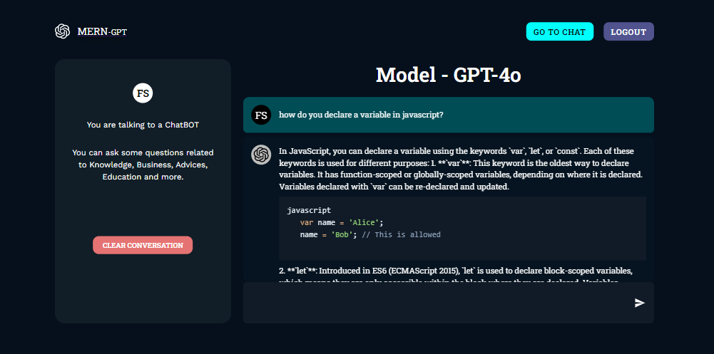

# MERN-GPT-AI - A chatbot using OPENAI API
This Chatbot application facilitates seamless interaction with the GPT-4 model, delivering intelligent conversational responses. It features a robust user authentication system, including login and signup functionalities, which save a cookie upon successful submission for secure access. Backed by JSON Web Token (JWT) validation, the application ensures a secure and personalized experience. Additionally, it connects directly to the GPT-4 model via the OpenAI API, enhancing its conversational capabilities and ensuring an engaging user experience.

Techologies used: React, Typescript, MaterialUI, Node.js, Express, MongoDB.

These are specific use cases of each library on this project

**Frontend Libraries used:**
- React-router-dom: Allows the user to navigate through different pages.
- React-type-animation: Used to create an interactive and engaging user experience by implementing dynamic text in the homepage.
- React-syntax-highlighter: Was integrated to display visually appealing code blocks whenever the user requests code generation.
- React-hot-toast: Shows an alert upon completing an action or an error occurs. 
- React-icons: Library used for importing icons.
- @Mui/material: This Library was used to create the user interface by importing pre-built components and applying styles to them.

**Backend Libraries used:**
- Express: this framework facilitates the setup of server environment by enabling the use middlewares, allows to handle HTTP requests and responses, and the creation of routes.
- Bcrypt: Is a library that enables the encryption of user passwords, enhancing security by preventing unauthorized access to sensitive information stored in the database. 
- Cookie-parser: Used for supporting signed cookies to ensure the integrity and authenticity of cookie data by verifying signatures and added middleware for better cookie management.
- Cors: Used to specify allowed origins, HTTP methods, and headers, this prevents unauthorized cross-origin requests.
- Dotenv: Used to load the sensitive information store in .env file by importing the config from dotenv.
- Express-validator: Used to easily validate the request bodies.
- Jsonwebtoken: It facilitates authentication by generating tokens that can be used to confirm a user's identity and grant access to protected resources.
- Mongoose: This library is an object data modeling that facilitates the connection to MongoDB and the definition of schemas for data models.
- Morgan: This library is used during development is a convenient way to log api's request displaying details about each request such as the HTTP method, URL, response time, and status code. 
- Openai: Used to facilitate the connection the OPENAI API.
- Ts-node: Allows to run Typescript code directly without the need to compile it to Javascript.

# Application live link
https://mern-gpt-openai-client.vercel.app
